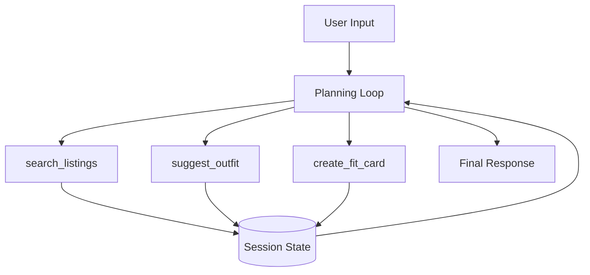

# FitFindr — planning.md

> Complete this document before writing any implementation code.
> Your spec and agent diagram are what you'll use to direct AI tools (Claude, Copilot, etc.) to generate your implementation — the more specific they are, the more useful the generated code will be.
> Your planning.md will be reviewed as part of your submission.
> Update it before starting any stretch features.

---

## Tools

List every tool your agent will use. For each tool, fill in all four fields.
You must have at least 3 tools. The three required tools are listed — add any additional tools below them.

### Tool 1: search_listings

**What it does:**
Searches the mock listings dataset for items matching the user's description, size, and price constraints.

**Input parameters:**
- `description` (str): Keywords describing what the user is looking for (e.g., "vintage graphic tee").
- `size` (str | None): Size string to filter by (e.g., "M"). Matching is case-insensitive.
- `max_price` (float | None): Maximum price (inclusive) to filter by.

**What it returns:**
A list of matching listing dicts, sorted by relevance. Each dict includes fields like `id`, `title`, `description`, `price`, `size`, `brand`, etc.

**What happens if it fails or returns nothing:**
Returns an empty list `[]`. The agent should inform the user that no matches were found and perhaps suggest broadening their search.

---

### Tool 2: suggest_outfit

**What it does:**
Suggests 1–2 complete outfits combining a thrifted item with pieces from the user's existing wardrobe using an LLM.

**Input parameters:**
- `new_item` (dict): The listing dict for the item being considered.
- `wardrobe` (dict): A dict containing an 'items' list of the user's wardrobe pieces.

**What it returns:**
A string containing outfit suggestions or general styling advice if the wardrobe is empty.

**What happens if it fails or returns nothing:**
If the wardrobe is empty, it returns general styling advice. If the LLM fails, it returns a fallback message about styling possibilities.

---

### Tool 3: create_fit_card

**What it does:**
Generates a short, catchy social media caption (2–4 sentences) for the potential thrift find and outfit.

**Input parameters:**
- `outfit` (str): The outfit suggestion string from Tool 2.
- `new_item` (dict): The listing dict for the thrifted item.

**What it returns:**
A string containing the social media caption.

**What happens if it fails or returns nothing:**
Returns a descriptive error message string.

---

### Additional Tools (if any)

None.

---

## Planning Loop

**How does your agent decide which tool to call next?**
The agent uses a ReAct-style loop. 
1. If the user is looking for items, it calls `search_listings`.
2. Once an item is selected (or the user expresses interest in a specific result), it calls `suggest_outfit`.
3. After an outfit is suggested, it calls `create_fit_card` to generate a social media post.
The loop terminates when the final caption is presented to the user or if the user stops the interaction.

---

## State Management

**How does information from one tool get passed to the next?**
State is managed within the agent's memory.
- `search_listings` results are stored and can be referenced by the user.
- The selected `new_item` is passed to `suggest_outfit`.
- The `outfit` suggestion from `suggest_outfit` and the `new_item` are passed to `create_fit_card`.

---

## Error Handling

For each tool, describe the specific failure mode you're handling and what the agent does in response.

| Tool | Failure mode | Agent response |
|------|-------------|----------------|
| search_listings | No results match the query | "I couldn't find any items matching those criteria. Would you like to try a different description or price range?" |
| suggest_outfit | Wardrobe is empty | "Since your wardrobe is empty, here's some general styling advice for this item..." |
| create_fit_card | Outfit input is missing or incomplete | "I couldn't generate a fit card because I don't have enough outfit details yet." |

---

## Architecture

---

## AI Tool Plan

**Milestone 3 — Individual tool implementations:**
I'll use Gemini CLI to implement each tool in `tools.py`. 
- `search_listings`: Implement filtering and basic keyword scoring.
- `suggest_outfit`: Use Groq API with a well-defined prompt.
- `create_fit_card`: Use Groq API with a high temperature for creative captions.

**Milestone 4 — Planning loop and state management:**
I'll implement the agent loop in `agent.py` using a structured approach to manage tool calls and state.

---

## A Complete Interaction (Step by Step)

**Example user query:** "I'm looking for a vintage graphic tee under $30. I mostly wear baggy jeans and chunky sneakers. What's out there and how would I style it?"

**Step 1:**
The agent calls `search_listings(description="vintage graphic tee", max_price=30.0)`.

**Step 2:**
The agent presents the top matches. The user picks one, e.g., "Y2K Baby Tee".

**Step 3:**
The agent calls `suggest_outfit(new_item=..., wardrobe=...)` using the user's provided wardrobe or an example one.

**Step 4:**
The agent calls `create_fit_card(outfit=..., new_item=...)`.

**Final output to user:**
"Here's a great Y2K Baby Tee for $18 on Depop! You can style it with your baggy jeans and chunky sneakers for a perfect streetwear look. 
Caption: Just found this butterfly baby tee for only $18 on Depop! Pairing it with my favorite baggy jeans and chunky sneakers for those Y2K vibes. #ThriftFinds #OOTD"
